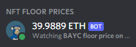

# Discord NFT Satellite

Simple script to run a Discord bot that displays the floor price of an NFT collection on OpenSea.



## Requirements
- [Discord Bot & Token](https://www.writebots.com/discord-bot-token/) 
- Python >= 3.8

## Permissions
Invite the bot into your Discord server and ensure it has a role with the following permissions: 
- View Channels
- Change Nickname

## Setup

1. Clone the repository: `git clone https://github.com/chillerno1/discord-nft-satellite`
2. cd into directory: `cd discord-nft-satellite`
3. Setup a virtual environment: `python -m venv venv`
4. Activate the virtual environment: `venv\Scripts\activate`
5. Install dependencies: `pip install -r requirements.txt`

## Usage

1. Get the [API url](https://docs.opensea.io/reference/retrieving-a-single-asset) of any asset in a collection you wish to display the floor price for (doesn't matter which one).
2. Run the following command:

```shell
usage: satellite.py [-h] --discord-token DISCORD_TOKEN --alias ALIAS --url URL

Bot to display the NFT floor price of a collection on OpenSea.
--------------------------------------------------------------

required arguments:
  -t, --discord-token   token for this Discord bot.
  -a, --alias           alias for the NFT collection to display (shown in Discord activity).
  -u, --url             opensea api url of any nft in the collection to display.

optional arguments:
  -h, --help            show this help message and exit
```

### Example
```
python .\satellite.py -t AAAAAAAA.aaa.AAAA -a BAYC -u https://api.opensea.io/api/v1/asset/0xbc4ca0eda7647a8ab7c2061c2e118a18a936f13d/3650
```
